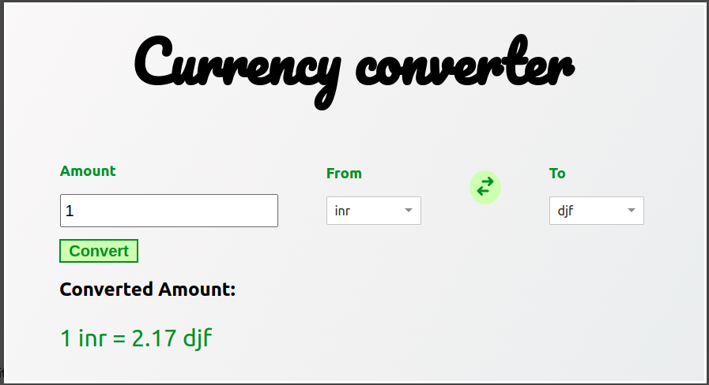

Use the below api to get the currencies and corresponding exchange rate

`curl --location --request GET 'https://cdn.jsdelivr.net/npm/@fawazahmed0/currency-api@latest/v1/currencies.json'`

`curl --location --request GET 'https://cdn.jsdelivr.net/npm/@fawazahmed0/currency-api@latest/v1/currencies/usd.json'`

Create a currency converter page following the below wireframe

